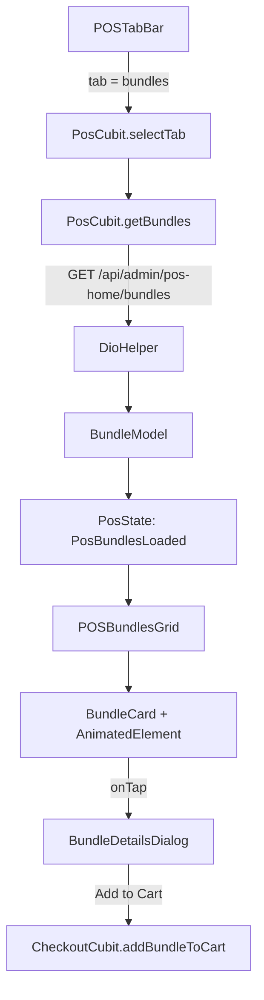
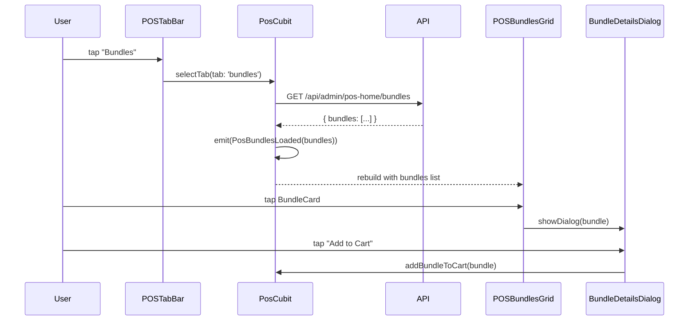

# Design Document: POS Bundles

## Overview

إضافة تبويب "Bundles" في POS Home بجانب Featured & Category & Brand، يعرض الباقات النشطة من الـ API مع بطاقات مصممة بأنيميشن وDialog لعرض تفاصيل الباقة وإضافتها للسلة.

الميزة تتبع نفس نمط الكود الموجود (Cubit + BlocBuilder) وتُضاف بأقل تعديل ممكن على الكود الحالي.

---

## Architecture



---

## Sequence Diagram



---

## Components and Interfaces

### 1. BundleModel (جديد في `pos_models.dart`)

```dart
class BundleProduct {
  final String productId;
  final String name;
  final String? image;
  final double price;
  final int quantity;
}

class BundleModel {
  final String id;
  final String name;
  final List<String> images;
  final double price;
  final double originalPrice;
  final double savings;
  final int savingsPercentage;
  final String startDate;
  final String endDate;
  final List<BundleProduct> products;
}
```

### 2. PosCubit (تعديل على الموجود)

إضافة:
```dart
List<BundleModel> bundles = [];

Future<void> getBundles() async { ... }

// في selectTab():
else if (tab == 'bundles') {
  emit(PosBundlesLoaded(bundles));
}
```

### 3. PosState (إضافة state جديد)

```dart
class PosBundlesLoaded extends PosState {
  final List<BundleModel> bundles;
  PosBundlesLoaded(this.bundles);
}
```

### 4. POSTabBar (تعديل على الموجود)

إضافة تبويب رابع "Bundles" بنفس نمط `_TabItem` الموجود.

### 5. POSBundlesGrid (ويدجت جديد)

```dart
class POSBundlesGrid extends StatelessWidget {
  final List<BundleModel> bundles;
  // GridView مع BundleCard + AnimatedElement
}
```

### 6. BundleCard (ويدجت جديد)

```dart
class BundleCard extends StatelessWidget {
  final BundleModel bundle;
  final VoidCallback onTap;
  final VoidCallback onAddToCart;
  // بطاقة تحتوي: أيقونة هدية، شارة خصم، اسم، عدد منتجات، سعر أصلي مشطوب، سعر جديد، Save، زر Add to Cart
}
```

### 7. BundleDetailsDialog (ويدجت جديد)

```dart
class BundleDetailsDialog extends StatelessWidget {
  final BundleModel bundle;
  final VoidCallback onAddToCart;
  // Dialog يعرض: اسم + شارة، أسعار، قائمة المنتجات، زر Cancel + Add to Cart
}
```

---

## Data Models

### BundleModel

| Field | Type | Source |
|-------|------|--------|
| id | String | `_id` |
| name | String | `name` |
| images | List\<String\> | `images` |
| price | double | `price` |
| originalPrice | double | `originalPrice` |
| savings | double | `savings` |
| savingsPercentage | int | `savingsPercentage` |
| startDate | String | `startdate` |
| endDate | String | `enddate` |
| products | List\<BundleProduct\> | `products[].product` |

### BundleProduct

| Field | Type | Source |
|-------|------|--------|
| productId | String | `productId` |
| name | String | `product.name` |
| image | String? | `product.image` |
| price | double | `product.price` |
| quantity | int | `quantity` |

---

## Visual Design

### BundleCard Layout

```
┌─────────────────────────────┐
│  [Gift Icon - cream bg]  -99%│  ← شارة خضراء
│                              │
│  Salma Bundle                │
│  4 Items                     │
│  ~~18700 EGP~~  (بنفسجي)    │  ← مشطوب
│  149.97 EGP     (أسود/bold) │
│  Save 18550 EGP (أخضر)      │
│  [  Add to Cart  ] (بنفسجي) │
└─────────────────────────────┘
```

### BundleDetailsDialog Layout

```
┌──────────────────────────────────┐
│  Salma Bundle          [-99%]    │
│  149.97 EGP  ~~18700~~  Save...  │
│  ─────────────────────────────   │
│  BUNDLE INCLUDES                 │
│  [img] Product Name  x1          │
│  [img] Product Name  x2          │
│  ─────────────────────────────   │
│  [Cancel]    [Add to Cart]       │
└──────────────────────────────────┘
```

---

## Algorithmic Pseudocode

### getBundles()

```pascal
PROCEDURE getBundles()
  INPUT: none
  OUTPUT: updates bundles list, emits state

  BEGIN
    response ← DioHelper.getData(url: EndPoint.posBundles)
    
    IF response.statusCode = 200 THEN
      data ← response.data['data']['bundles'] as List
      bundles ← data.map(BundleModel.fromJson).toList()
    END IF
  END
END PROCEDURE
```

**Preconditions:** الـ shift مفتوح والـ token موجود
**Postconditions:** `bundles` تحتوي على قائمة الباقات النشطة

### selectTab() - تعديل

```pascal
PROCEDURE selectTab(tab)
  ...
  ELSE IF tab = 'bundles' THEN
    IF bundles.isEmpty THEN
      await getBundles()
    END IF
    emit(PosBundlesLoaded(bundles))
  END IF
END PROCEDURE
```

**Loop Invariant:** N/A

### addBundleToCart()

```pascal
PROCEDURE addBundleToCart(bundle)
  INPUT: bundle: BundleModel
  OUTPUT: يضيف الباقة كـ CartItem واحد

  BEGIN
    // تحويل الباقة لـ Product مؤقت أو CartItem مخصص
    cartItem ← BundleCartItem(
      bundleId: bundle.id,
      name: bundle.name,
      price: bundle.price,
      quantity: 1
    )
    CheckoutCubit.addBundleToCart(cartItem)
  END
END PROCEDURE
```

---

## Files to Create/Modify

### ملفات جديدة
```
lib/features/POS/home/presentation/widgets/bundle_card.dart
lib/features/POS/home/presentation/widgets/bundle_details_dialog.dart
lib/features/POS/home/presentation/widgets/bundles_grid.dart
```

### ملفات تُعدَّل
```
lib/features/POS/home/model/pos_models.dart         ← إضافة BundleModel, BundleProduct
lib/features/POS/home/cubit/pos_home_cubit.dart     ← إضافة getBundles(), تعديل selectTab()
lib/features/POS/home/cubit/pos_home_state.dart     ← إضافة PosBundlesLoaded
lib/features/POS/home/presentation/widgets/tab_bar.dart  ← إضافة تبويب Bundles
lib/features/POS/home/presentation/view/pos_home_screen.dart ← ربط PosBundlesLoaded بـ POSBundlesGrid
lib/core/services/endpoints.dart                    ← إضافة posBundles endpoint
```

---

## Animation Strategy

يتبع نفس نمط `AnimatedElement` الموجود:
- كل `BundleCard` يُلف بـ `AnimatedElement` مع delay متدرج (`index * 100ms`)
- الـ Dialog يستخدم `showDialog` مع `AnimatedElement` للمحتوى الداخلي
- Scale + Fade + Slide من اليمين (نفس الـ animation الموجودة)

---

## Error Handling

| الحالة | التعامل |
|--------|---------|
| API فشل | `log('Bundles error: $e')` - لا يوقف التطبيق (نفس نمط categories/brands) |
| قائمة فارغة | عرض رسالة "No bundles available" |
| صورة مكسورة | fallback لأيقونة `Icons.card_giftcard` |

---

## Testing Strategy

### Unit Tests (مركزة على المنطق فقط)

1. `BundleModel.fromJson()` - يحول JSON بشكل صحيح
2. `PosCubit.selectTab('bundles')` - يستدعي `getBundles()` ويُصدر `PosBundlesLoaded`
3. `PosCubit.getBundles()` - يملأ قائمة `bundles` من الـ API response

### Widget Tests

1. `BundleCard` - يعرض الاسم والسعر والخصم بشكل صحيح
2. `BundleDetailsDialog` - يعرض قائمة المنتجات ويستدعي `onAddToCart`

---

## Dependencies

لا توجد dependencies جديدة - الميزة تستخدم:
- `flutter_bloc` (موجود)
- `cached_network_image` (موجود)
- `dio` عبر `DioHelper` (موجود)
- `AnimatedElement` (موجود في `lib/core/widgets/animation/`)


---

## Correctness Properties

*A property is a characteristic or behavior that should hold true across all valid executions of a system.*

### Property 1: selectTab('bundles') يُصدر PosBundlesLoaded

*For any* PosCubit instance, calling selectTab('bundles') should always result in emitting a PosBundlesLoaded state containing the bundles list.

**Validates: Requirements 1.2, 1.3**

### Property 2: BundleModel.fromJson round-trip

*For any* valid BundleModel object, converting it to JSON then parsing it back with fromJson() should produce an equivalent object with identical field values.

**Validates: Requirements 5.2, 5.3**

### Property 3: BundleCard تعرض بيانات الباقة كاملة

*For any* BundleModel, rendering a BundleCard should produce a widget tree that contains the bundle name, discounted price, original price, savings amount, and product count.

**Validates: Requirements 2.1, 2.2**

### Property 4: BundleDetailsDialog يعرض كل المنتجات

*For any* BundleModel with N products, the BundleDetailsDialog should display exactly N product entries, each showing the product name and quantity.

**Validates: Requirements 3.2**

### Property 5: فشل API لا يوقف التطبيق

*For any* network error during getBundles(), the PosCubit should emit PosBundlesLoaded with an empty list rather than throwing an unhandled exception.

**Validates: Requirements 4.3**
