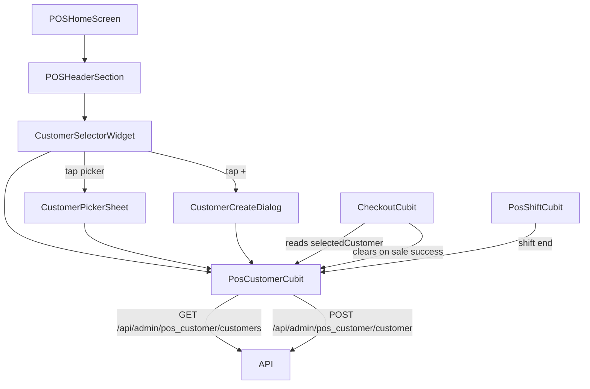

# Design Document: POS Customer Selection

## Overview

This feature adds a dedicated customer selection flow to the POS home screen. A new `PosCustomerCubit` manages the customer list and selected customer independently from the existing `PosCubit`. The UI introduces a `CustomerSelectorWidget` in the header, a `CustomerPickerSheet` bottom sheet for browsing/searching, and a `CustomerCreateDialog` for inline customer creation. Checkout is gated behind customer selection via a guard in `CheckoutCubit.createSale`.

The design deliberately keeps customer state in its own cubit rather than extending `PosCubit`, preserving separation of concerns and making the customer lifecycle (fetch → select → clear on sale) independently testable.

---

## Architecture



**State flow:**

```
PosCustomerInitial
  → PosCustomerLoading       (fetching list)
  → PosCustomerLoaded        (list ready, selectedCustomer may be null)
  → PosCustomerError         (fetch failed)
  → PosCustomerCreating      (POST in flight)
  → PosCustomerCreateSuccess (new customer added + selected)
  → PosCustomerCreateError   (POST failed)
```

---

## Components and Interfaces

### PosCustomerCubit

Responsible for: fetching the customer list, creating new customers, tracking the selected customer, and clearing state on shift end or sale completion.

```dart
class PosCustomerCubit extends Cubit<PosCustomerState> {
  // Mutable state fields
  List<PosCustomer> customers;
  PosCustomer? selectedCustomer;

  // Actions
  Future<void> fetchCustomers();
  Future<void> createCustomer({required String name, required String phone, String? email, String? address});
  void selectCustomer(PosCustomer customer);
  void clearSelectedCustomer();
  void clearAll(); // called on shift end
}
```

### CustomerSelectorWidget

A stateless widget placed in `POSHeaderSection`. Displays either the placeholder or the selected customer's name + phone. Has a "+" `IconButton` to its right.

```dart
class CustomerSelectorWidget extends StatelessWidget {
  // Reads PosCustomerCubit via BlocBuilder
  // onTap → opens CustomerPickerSheet
  // onAddTap → opens CustomerCreateDialog
}
```

### CustomerPickerSheet

A modal bottom sheet with:
- A `TextField` for search (filters in-memory, case-insensitive on name + phone)
- A `ListView` of `PosCustomer` tiles
- Empty state widget when list is empty or search yields no results

```dart
void showCustomerPickerSheet(BuildContext context) {
  showModalBottomSheet(
    context: context,
    isScrollControlled: true,
    builder: (_) => BlocProvider.value(
      value: context.read<PosCustomerCubit>(),
      child: const CustomerPickerSheet(),
    ),
  );
}
```

### CustomerCreateDialog

An `AlertDialog` with form fields: name (required), phone (required), email (optional), address (optional). Validates required fields client-side before calling `PosCustomerCubit.createCustomer`. Shows inline error on API failure without closing.

### CheckoutCubit (modifications)

`createSale` gains a `customerId` parameter. The caller (POSHomeScreen) reads `PosCustomerCubit.selectedCustomer` and passes the id. The checkout guard lives in the UI layer — the "Place Order" / checkout button checks `selectedCustomer != null` before calling `createSale`.

After `CheckoutSuccess`, the screen calls `PosCustomerCubit.clearSelectedCustomer()`.

---

## Data Models

### PosCustomer

New model in `lib/features/POS/customer/model/pos_customer_model.dart`:

```dart
class PosCustomer {
  final String id;           // _id
  final String name;
  final String? email;
  final String phoneNumber;  // phone_number
  final String? address;
  final String? country;
  final String? city;
  final String? customerGroupId;
  final double totalPointsEarned;
  final double amountDue;
  final bool isDue;

  factory PosCustomer.fromJson(Map<String, dynamic> json);
  Map<String, dynamic> toCreateJson(); // for POST body
}
```

### API Endpoints (additions to EndPoint class)

```dart
static const String getPosCustomers = '/api/admin/pos_customer/customers';
static const String createPosCustomer = '/api/admin/pos_customer/customer';
```

### PosCustomerState hierarchy

```dart
abstract class PosCustomerState {}
class PosCustomerInitial extends PosCustomerState {}
class PosCustomerLoading extends PosCustomerState {}
class PosCustomerLoaded extends PosCustomerState {
  final List<PosCustomer> customers;
  final PosCustomer? selectedCustomer;
}
class PosCustomerError extends PosCustomerState { final String message; }
class PosCustomerCreating extends PosCustomerState {}
class PosCustomerCreateSuccess extends PosCustomerState {
  final PosCustomer newCustomer;
}
class PosCustomerCreateError extends PosCustomerState { final String message; }
```

---

## Correctness Properties

*A property is a characteristic or behavior that should hold true across all valid executions of a system — essentially, a formal statement about what the system should do. Properties serve as the bridge between human-readable specifications and machine-verifiable correctness guarantees.*

### Property 1: Selector display reflects customer state

*For any* customer state — when `selectedCustomer` is null the `CustomerSelectorWidget` must show the placeholder text "Select Customer" with a chevron-down icon; when `selectedCustomer` is a `PosCustomer`, the widget must display that customer's name and phone number.

**Validates: Requirements 1.2, 1.3, 3.3**

---

### Property 2: "+" button is always present

*For any* customer state (null or non-null selected customer), the `CustomerSelectorWidget` must always render the "+" `IconButton` to the right of the selector.

**Validates: Requirements 1.4**

---

### Property 3: Search filter returns correct subset

*For any* customer list and any search query string, the filtered result must be a subset of the original list and every item in the result must contain the query string in its name or phone number (case-insensitive). Items not matching must be excluded.

**Validates: Requirements 2.5**

---

### Property 4: Customer list tiles show name and phone

*For any* list of `PosCustomer` records rendered in `CustomerPickerSheet`, each tile must display both the customer's name and phone number.

**Validates: Requirements 2.4**

---

### Property 5: Customer selection updates cubit state

*For any* `PosCustomer` in the customer list, after `selectCustomer(customer)` is called, the cubit's `selectedCustomer` must equal that customer and the emitted `PosCustomerLoaded` state must carry the same value.

**Validates: Requirements 3.1**

---

### Property 6: Cart operations are independent of customer selection state

*For any* combination of cart state and customer selection state (null or non-null), all cart operations (add, remove, update quantity) must succeed without error and must not modify `selectedCustomer`.

**Validates: Requirements 4.1, 4.2, 7.3**

---

### Property 7: Checkout guard enforces customer selection

*For any* cart state, if `selectedCustomer` is null, the checkout guard must block the checkout flow and surface an error message; if `selectedCustomer` is non-null, the checkout flow must be permitted to proceed.

**Validates: Requirements 5.1, 5.2, 5.3**

---

### Property 8: Sale payload includes selected customer id

*For any* successful `createSale` call where a customer is selected, the HTTP request body must contain `customer_id` equal to `selectedCustomer._id`.

**Validates: Requirements 5.4**

---

### Property 9: Create customer round-trip

*For any* valid name and phone number, if `createCustomer` succeeds, the new `PosCustomer` must appear in `PosCustomerCubit.customers` and `selectedCustomer` must equal the newly created customer.

**Validates: Requirements 6.3, 6.4**

---

### Property 10: Blank required fields are rejected

*For any* string composed entirely of whitespace characters (or the empty string) supplied as name or phone in `CustomerCreateDialog`, the form must reject submission, display a validation error, and must not invoke `PosCustomerCubit.createCustomer`.

**Validates: Requirements 6.6**

---

### Property 11: Customer cleared after successful sale

*For any* successful `createSale` call, `PosCustomerCubit.selectedCustomer` must be null immediately after the sale completes.

**Validates: Requirements 7.1**

---

### Property 12: Full customer state cleared on shift end

*For any* shift-end event, both `PosCustomerCubit.selectedCustomer` and `PosCustomerCubit.customers` must be empty/null after `clearAll()` is called.

**Validates: Requirements 7.2**

---

## Error Handling

| Scenario | Handling |
|---|---|
| `GET /api/admin/pos_customer/customers` fails | Emit `PosCustomerError`; show `CustomSnackbar.showError` on screen |
| `POST /api/admin/pos_customer/customer` fails | Emit `PosCustomerCreateError`; display error inside `CustomerCreateDialog` without closing it |
| Checkout attempted without customer | Show `CustomSnackbar.showError("Please select a customer before checkout")`; do not open checkout sheet |
| Empty customer list | Show empty-state widget inside `CustomerPickerSheet` |
| Search yields no results | Show "No customers match your search" message inside `CustomerPickerSheet` |

---

## Testing Strategy

### Unit Tests

- `PosCustomer.fromJson` correctly maps all fields including nullable ones
- `PosCustomer.toCreateJson` produces the expected POST body keys
- `CustomerPickerSheet` search filter logic (pure function) returns correct subsets
- `CustomerCreateDialog` form validation rejects blank name/phone

### Property-Based Tests

Use the `fast_check` package (or `dart_test` with custom generators) with a minimum of 100 iterations per property.

Each test is tagged with: `// Feature: pos-customer-selection, Property N: <property text>`

| Property | Test description |
|---|---|
| P1: Customer selection reflected | Generate random `PosCustomer`, call `selectCustomer`, assert state carries same customer |
| P2: Search filter subset | Generate random customer list + query string, assert all results contain query in name or phone |
| P3: Create customer round-trip | Mock API success, generate random name+phone, assert customer in list and selected |
| P4: Checkout blocked without customer | Generate random cart, null selectedCustomer, assert guard fires and error shown |
| P5: Customer cleared after sale | Mock successful sale, assert `selectedCustomer == null` post-call |
| P6: Blank field validation | Generate whitespace-only strings for name/phone, assert form rejects and cubit not called |

### Integration / Widget Tests

- `CustomerSelectorWidget` shows placeholder when no customer selected
- `CustomerSelectorWidget` shows name + phone when customer is selected
- Tapping selector opens `CustomerPickerSheet`
- Tapping "+" opens `CustomerCreateDialog`
- Selecting a customer in the sheet closes it and updates the selector
- Successful customer creation closes dialog and updates selector
