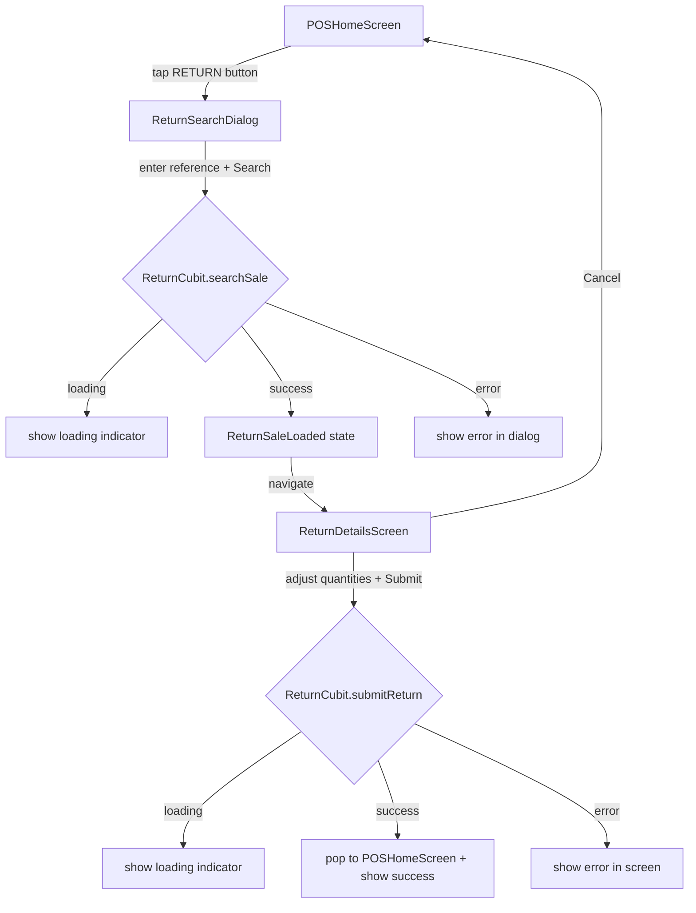
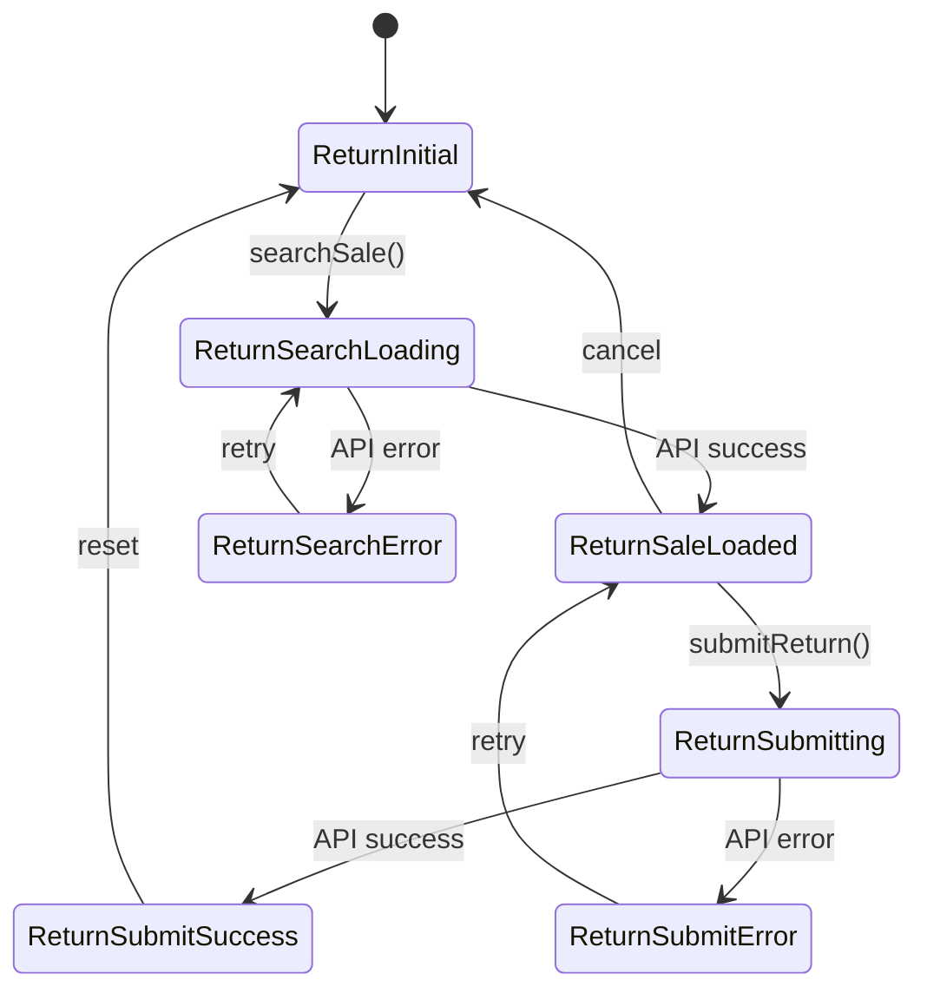

# Design Document: POS Return Sale

## Overview

تضيف هذه الميزة وظيفة إرجاع المبيعات (Return Sale) إلى شاشة POS الرئيسية في تطبيق Flutter. يتمكن الكاشير من البحث عن فاتورة بيع سابقة عبر رقم المرجع، مراجعة تفاصيلها، تحديد الكميات المراد إرجاعها لكل منتج، ثم إرسال طلب الإرجاع إلى الـ API.

الميزة مستقلة تماماً عن تدفق البيع الحالي، وتتكامل مع `PosCubit` الموجود فقط لقراءة `selectedAccount` (حساب الاسترداد).

---

## Architecture

تتبع الميزة نمط BLoC/Cubit المستخدم في المشروع، وتنقسم إلى طبقتين رئيسيتين:

```
Presentation Layer
  ├── ReturnSearchDialog       ← نافذة البحث عن الفاتورة
  ├── ReturnDetailsScreen      ← شاشة تفاصيل الإرجاع
  ├── ReturnItemsTable         ← جدول المنتجات القابلة للإرجاع
  └── POSNavBar (modified)     ← إضافة زر RETURN

State Management Layer
  └── ReturnCubit / ReturnState

Data Layer
  ├── ReturnSaleModel          ← موديل الفاتورة
  └── ReturnItemModel          ← موديل عنصر الإرجاع
```

### تدفق العمل (Flow)



### إدارة الحالة



---

## Components and Interfaces

### 1. ReturnCubit

المسؤول الوحيد عن منطق الإرجاع. يُقدَّم على مستوى `POSHomeScreen` ليستمر عبر الـ navigation.

```dart
class ReturnCubit extends Cubit<ReturnState> {
  // البحث عن الفاتورة
  Future<void> searchSale(String reference);

  // تحديث كمية الإرجاع لعنصر معين
  void updateReturnQuantity(int index, int quantity);

  // إرسال طلب الإرجاع
  Future<void> submitReturn({
    required String refundAccountId,
    required String note,
  });

  // إعادة التهيئة
  void reset();
}
```

### 2. ReturnSearchDialog

نافذة بسيطة تحتوي على:
- `TextField` لرقم المرجع
- زر "Search Sale" (بنفسجي)
- زر "Cancel"
- مؤشر تحميل أثناء البحث
- عرض رسالة الخطأ داخل النافذة

### 3. ReturnDetailsScreen

شاشة كاملة تعرض:
- معلومات الفاتورة (Reference, Date, Customer, Warehouse, Cashier, Manager)
- `ReturnItemsTable` — جدول المنتجات مع stepper للكمية
- حقل "Return Note" (اختياري)
- زر "Submit Return" (بنفسجي)
- زر "Cancel"

### 4. ReturnItemsTable

`Widget` مستقل يعرض جدول المنتجات:
- الأعمدة: Product, Code, Qty, Available, Return Qty
- كل صف يحتوي على stepper (زر + وزر -) مع حد أقصى = `available_to_return`

### 5. POSNavBar (تعديل)

إضافة زر "RETURN" إلى `POSTabBar` أو `AppBar` الموجود، بنفس نمط الأزرار الحالية مع لون `AppColors.categoryPurple` عند التفعيل.

---

## Data Models

### ReturnSaleModel

يمثل الفاتورة المُسترجعة من الـ API:

```dart
class ReturnSaleModel {
  final String id;           // sale._id
  final String reference;    // sale.reference
  final String date;         // sale.date
  final String? customerName; // sale.customer?.name (nullable)
  final String warehouseName; // sale.warehouse.name
  final String cashierEmail;  // sale.created_by.email
  final String cashierName;   // sale.shift.cashier.name
  final String cashierManName; // sale.shift.cashierman.username
  final List<ReturnItemModel> items;

  // Walk-in Customer fallback
  String get displayCustomerName => customerName ?? 'Walk-in Customer';

  factory ReturnSaleModel.fromJson(Map<String, dynamic> json);
}
```

### ReturnItemModel

يمثل منتجاً واحداً في قائمة الإرجاع:

```dart
class ReturnItemModel {
  final String id;               // item._id
  final String saleId;           // item.sale_id
  final String productName;      // item.product.name
  final String productCode;      // item.product.code
  final String productPriceId;   // item.product_price._id ?? item.product._id
  final int quantity;            // الكمية الأصلية
  final int alreadyReturned;     // item.already_returned
  final int availableToReturn;   // item.available_to_return
  int returnQuantity;            // الكمية المطلوب إرجاعها (mutable, default 0)

  factory ReturnItemModel.fromJson(Map<String, dynamic> json);
}
```

**ملاحظة:** `productPriceId` يستخدم `product_price._id` إذا كان موجوداً، وإلا يرجع إلى `product._id`.

### ReturnState

```dart
abstract class ReturnState {}

class ReturnInitial extends ReturnState {}

class ReturnSearchLoading extends ReturnState {}

class ReturnSaleLoaded extends ReturnState {
  final ReturnSaleModel sale;
  final List<ReturnItemModel> items;
}

class ReturnSearchError extends ReturnState {
  final String message;
}

class ReturnSubmitting extends ReturnState {
  final ReturnSaleModel sale;
  final List<ReturnItemModel> items;
}

class ReturnSubmitSuccess extends ReturnState {}

class ReturnSubmitError extends ReturnState {
  final ReturnSaleModel sale;
  final List<ReturnItemModel> items;
  final String message;
}
```

### Request Body (POST /api/admin/return-sale/create-return)

```dart
{
  "sale_id": sale.id,
  "items": items
      .where((i) => i.returnQuantity > 0)
      .map((i) => {
        "product_price_id": i.productPriceId,
        "quantity": i.returnQuantity,
        "reason": "",  // حقل مطلوب من الـ API، يُرسل فارغاً
      })
      .toList(),
  "refund_account_id": refundAccountId,  // من PosCubit.selectedAccount
  "note": note,  // من حقل Return Note، أو "" إذا كان فارغاً
}
```

---

## API Endpoints

| Method | Endpoint | الغرض |
|--------|----------|-------|
| GET | `/api/admin/pos/sales?reference={ref}` | البحث عن الفاتورة برقم المرجع |
| POST | `/api/admin/return-sale/create-return` | إرسال طلب الإرجاع |

**ملاحظة:** endpoint البحث هو نفس `EndPoint.getAllSales` الموجود مع إضافة query parameter `reference`.

---

## Correctness Properties

*A property is a characteristic or behavior that should hold true across all valid executions of a system — essentially, a formal statement about what the system should do. Properties serve as the bridge between human-readable specifications and machine-verifiable correctness guarantees.*

### Property 1: Empty/Whitespace Reference Rejected

*For any* string composed entirely of whitespace or empty string, calling `searchSale` should not emit `ReturnSearchLoading` and should not call the API.

**Validates: Requirements 2.4**

---

### Property 2: Valid Reference Triggers Search

*For any* non-empty, non-whitespace reference string, calling `searchSale` should emit `ReturnSearchLoading` as the first state transition.

**Validates: Requirements 2.5**

---

### Property 3: API Success Emits Loaded State

*For any* valid API response containing a sale object with items, `ReturnCubit.searchSale` should emit `ReturnSaleLoaded` with a non-null `ReturnSaleModel` and a non-empty items list.

**Validates: Requirements 2.7**

---

### Property 4: API Failure Emits Error State

*For any* API error response or network exception, `ReturnCubit.searchSale` should emit `ReturnSearchError` with a non-empty error message.

**Validates: Requirements 2.8**

---

### Property 5: Return Quantity Invariant

*For any* `ReturnItemModel` and any sequence of increment/decrement operations on `returnQuantity`, the value must always satisfy `0 <= returnQuantity <= availableToReturn`.

**Validates: Requirements 4.3, 4.4**

---

### Property 6: All-Zero Quantities Rejected

*For any* list of `ReturnItemModel` where all `returnQuantity` values are 0, calling `submitReturn` should not emit `ReturnSubmitting` and should not call the API.

**Validates: Requirements 5.1**

---

### Property 7: Request Body Contains Only Non-Zero Items

*For any* list of `ReturnItemModel` with at least one item having `returnQuantity > 0`, the constructed request body's `items` array should contain exactly the items where `returnQuantity > 0`, each with the correct `product_price_id`, `quantity`, and `reason` fields.

**Validates: Requirements 5.2, 5.3**

---

### Property 8: JSON Parsing Round-Trip

*For any* valid API response JSON for the sale search endpoint, parsing it into `ReturnSaleModel` and `ReturnItemModel` should produce objects with all required fields populated without throwing exceptions, and re-serializing the key fields should produce equivalent values.

**Validates: Requirements 6.3**

---

### Property 9: Null Customer Fallback

*For any* API response where `customer` is null, `ReturnSaleModel.displayCustomerName` should return exactly `"Walk-in Customer"`.

**Validates: Requirements 3.2** *(edge-case)*

---

### Property 10: Null product_price Fallback

*For any* item JSON where `product_price` is null, `ReturnItemModel.productPriceId` should equal `product._id`.

**Validates: Requirements 6.4** *(edge-case)*

---

### Property 11: Reset Clears State

*For any* `ReturnCubit` state (loaded, error, submitting), calling `reset()` should always result in `ReturnInitial` state with no retained sale data.

**Validates: Requirements 7.2, 7.4**

---

## Error Handling

| السيناريو | السلوك |
|-----------|--------|
| Reference فارغ عند البحث | عرض validation error داخل الـ dialog، لا يُستدعى الـ API |
| فشل API البحث (network/server) | emit `ReturnSearchError`، عرض الرسالة داخل الـ dialog |
| لا توجد فاتورة بهذا الـ reference | emit `ReturnSearchError` برسالة "Sale not found" |
| كل الكميات = 0 عند الإرسال | عرض validation error داخل الشاشة، لا يُستدعى الـ API |
| فشل API الإرسال | emit `ReturnSubmitError`، عرض الرسالة داخل الشاشة دون إغلاقها |
| `product_price` = null في الـ response | استخدام `product._id` كـ fallback |
| `customer` = null في الـ response | عرض "Walk-in Customer" |
| `selectedAccount` = null في PosCubit | عرض رسالة خطأ قبل فتح الـ dialog |

---

## Testing Strategy

### Dual Testing Approach

الاختبارات تنقسم إلى نوعين متكاملين:

**Unit Tests** — للأمثلة المحددة والـ edge cases:
- `ReturnSaleModel.fromJson` يُعيد الحقول الصحيحة
- `ReturnItemModel.fromJson` مع `product_price = null` يستخدم `product._id`
- `ReturnSaleModel.displayCustomerName` يُعيد "Walk-in Customer" عند null
- تكامل `ReturnCubit` مع `POSHomeScreen` (BlocProvider)

**Property-Based Tests** — للخصائص العامة:
- استخدام مكتبة `dart_test` مع `package:test` و `package:faker` أو كتابة generators يدوية
- الحد الأدنى: **100 iteration** لكل property test
- كل property test يُشير إلى رقم الـ property في التعليق

### Property Test Configuration

```dart
// Feature: pos-return-sale, Property 5: Return Quantity Invariant
test('returnQuantity always within [0, availableToReturn]', () {
  // run 100+ iterations with random items and random operations
});
```

### Tag Format

كل property test يجب أن يحتوي على تعليق بالصيغة:
```
// Feature: pos-return-sale, Property {N}: {property_text}
```

### Test Files Structure

```
test/features/POS/return/
  cubit/
    return_cubit_test.dart      ← unit + property tests للـ cubit
  models/
    return_sale_model_test.dart ← unit + property tests للـ models
  widgets/
    return_search_dialog_test.dart
    return_details_screen_test.dart
```

### Coverage Goals

- كل property في هذا الوثيقة يجب أن يقابلها property-based test واحد
- الـ edge cases (Property 9, 10) تُختبر كـ unit tests
- الـ UI examples (1.1, 1.4, 2.1) تُختبر كـ widget tests
